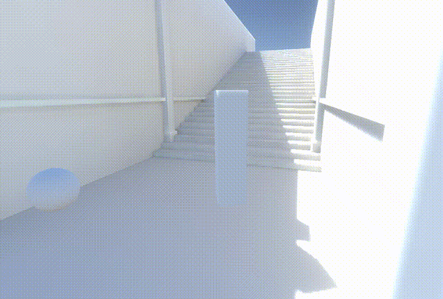
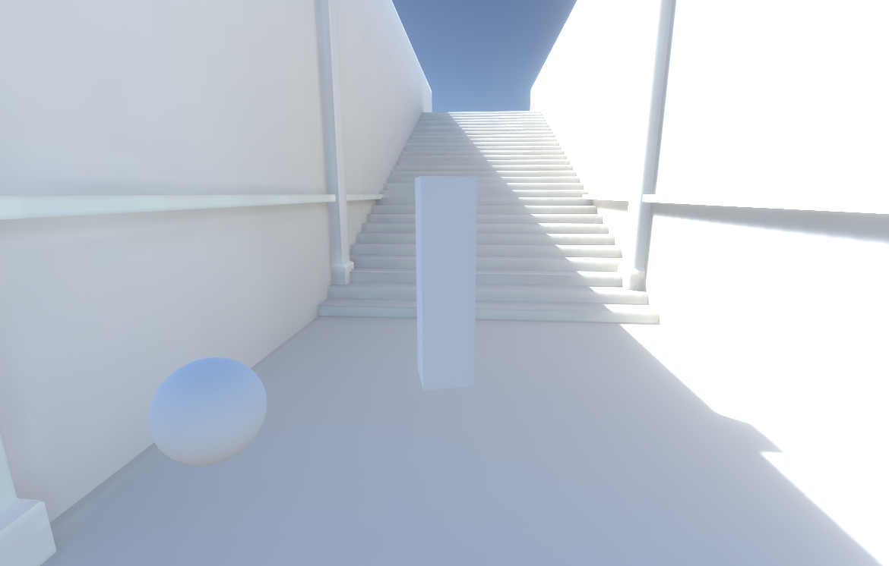
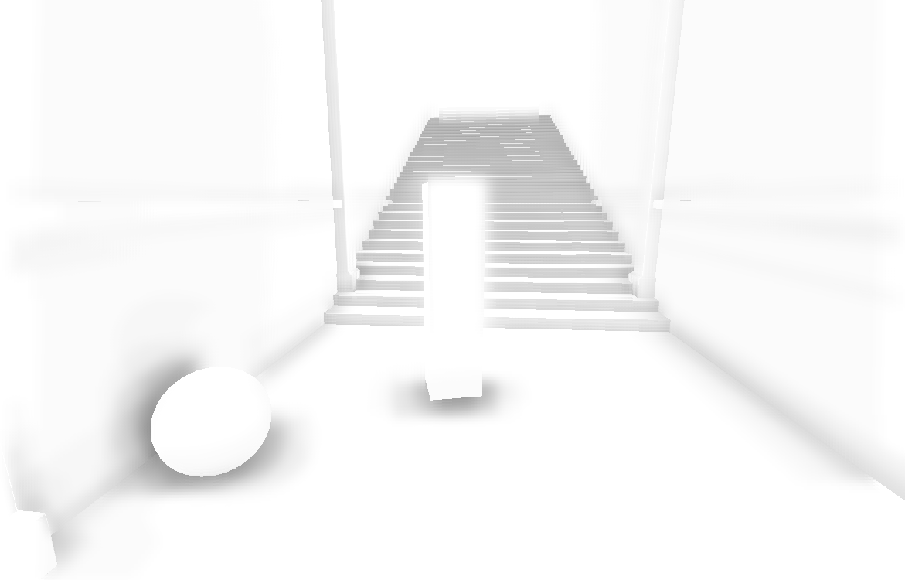
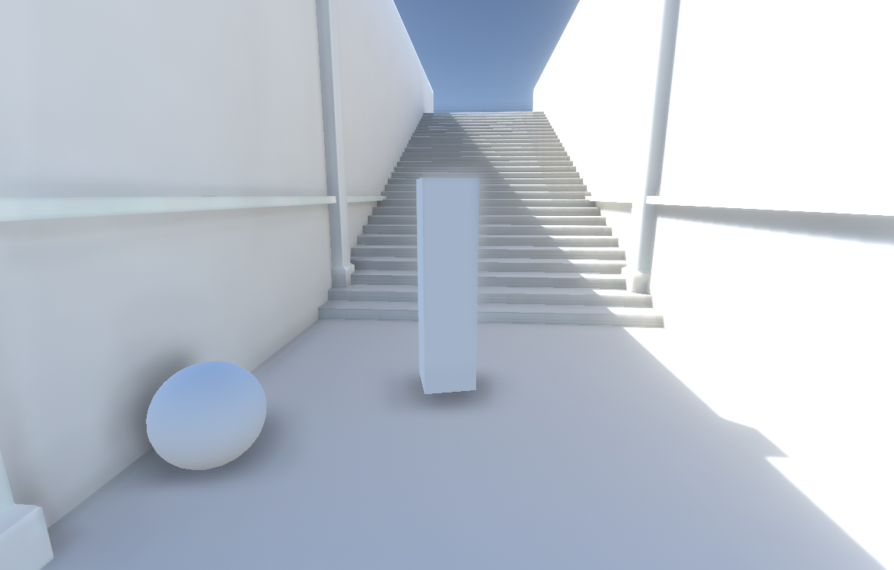

# TA-Learning

正在走技术美术学习路线，在此建仓记录，持续更新。

## Unity

技美基本都要求至少熟悉一款三维引擎，初学者接触最多的无非就是UE和Unity，而UE的拟物大图标实在太丑了所以我选Unity，欸嘿。

### [Lembert卡渲](./Unity/L01)

最开始用的还是SF连连看的方式，先抛开代码体验编着色器，在最简单的兰伯特光照模型后多连个一维UV采样就能出不错的效果，还能再加点别的“特技”，有意思。

### [Screen-Door Transparency](./Unity/P01)

入坑原神以前旁观同学游玩的时候就注意到了游戏里的靠近消隐效果有点好玩，把玩了一阵子SF后就想着自个儿连个类似效果出来，虽然人家游戏里肯定不是用的这种方式实现。

### [Phong与Bilinn-Phong](./Unity/L02)

有了半兰伯特模型作Diffuse，还得再加点Specular，这俩就是最经典的高光模型了。

### [环境吸收与投影](./Unity/L03)

开始自己敲代码写着色器，左边是用SP烘焙好AO贴图直接采样的，右边在Fallback中调用了Unity内置支持阴影的Pass。

### [法线贴图](./Unity/L04)

尝试在代码中对法线贴图采样来实现假凹凸光影效果。

### [CubeMap与MatCap](./Unity/L05)

CubeMap是一个立方体的六面展开图，让人惊奇的是（或者让人很不惊奇，如果你是数学大佬），从立方体中心和从球体中心向四周观察到的图像看起来是一样的，Unity中的天空盒使用的就是立方体形式。使用CubeMap的环境反射由于记录了全景环境信息所以能够跟随视角做出改变，而MatCap只存储了单个视角的反射信息看起来比较呆（但它省开销呀，根据实际情况选择吧）。

### [经典光照模型实例](Unity/L06)

漫射、反射等光照模型与各类贴图信息的综合使用，模型和贴图资源来源于Steam上关于Dota2的某篇文档。

### [透明中的AlphaCut、AlphaBlend与AlphaAdd](Unity/L07)

透贴的各种模式，当然还有更多的可以自由定义，这里是庄老师讲到的常用的三种。

### [水与火特效](Unity/L08)

发现游戏里类似的特效很多是靠贴图采样实现的，这就对美术资源的要求更高一些，懒得自己做贴图的话效果好不好全看手上图片资源的质量了。

### [背景扰动](Unity/L09)

对背景图像采样做UV扰动的结果，可以作为假透明折射效果，扰动值也可以从图片中采样。

### [顶点动画](Unity/L10)

顾名思义，在几何着色器中直接对顶点做出位移，不需要动模型本身就能实现的动画。

### [科幻出入场](Unity/L11)

前几个Demo所涉及知识点的综合运用，大半时间都花在贴图准备上了，还去入门了一下SD，果然做这行得玩转得过来一堆软件……

### [SSAO](Unity/P02)

在赫塔那儿接完声望任务转身上楼的时候发现凌华身上泛着一圈白光，那地方完全处在阴影之中首先排除了是Bloom，调整游戏图像设置后发现是后期效果带来的，盲猜用了SSAO，因为其中的远景阴影剔除正好会造成这个特性，不如咱自己也来实现一下。

首先照着游戏搭了个差不多的场景（AO什么的在这种犄角旮旯多的楼道最好体现了），为了观察方便顺手加个第三人称控制器。

为了场景好看一点专门烘焙了全局光照，结果为了在自定义着色器中用上光照贴图踩了不少坑，下面是烘焙好的间接光照混合直接阴影的结果。

接着就是SSAO算法了，实现起来比预想的要难得多，都怪自己太菜，还好网上做知识分享的大佬多，看一下最后的效果吧。

再叠加上GI看看，差不多复现了游戏里角色身上的白光晕。

### [John Lemon's Haunted Jaunt](Unity/L12)

这是Unity官方的3D项目入门教程，玩了这么久Shader发现还没有经历过游戏的全流程开发，总感觉缺了点什么，特此体验，以后也多上上手。（最近开始忙毕设了，估计要停更好一段时间了。）

## Houdini

Houdini作为影视游戏行业的老大哥软件还是值得学一学的，尤其是其节点操作逻辑可以顺便培养一下程序化思维。

### [IceGrowth冰生长](Houdini/L01)

本案例的重点是冰的程序化生成，跟着教程做下来发现方法还是比较粗暴的233，并没有什么基于物理生成的说法。

### [阴影拼图](Houdini/L02)

有时候富有创意的效果只需要用到最最基础的几何关系，至于是怎么做的……对，没错就是你脑子里想的那样。

