# TA-Learning

正在走技术美术学习路线，在此建仓记录，持续更新（仅按时间归档）。

## 01 [Lembert卡渲](./Lembert_ToonShader)

技美基本都要求至少熟悉一款三维引擎，初学者接触最多的无非就是UE和Unity，而UE的拟物大图标实在太丑了所以我选Unity，欸嘿。

选好了引擎熟悉完就从着色器开始吧，最开始用的还是SF连连看的方式，先抛开代码体验编着色器，在最简单的兰伯特光照模型后多连个一维UV采样就能出不错的效果，还能再加点别的“特技”，有意思。

## 02 [Screen-Door Transparency](./SDTransparency)

入坑原神以前旁观同学游玩的时候就注意到了游戏里的靠近消隐效果有点好玩，把玩了一阵子SF后就想着自个儿连个类似效果出来，虽然人家游戏里肯定不是用的这种方式实现。

## 03 [Phong与Bilinn-Phong](./Phong_BilinnPhong)

有了半兰伯特模型作Diffuse，还得再加点Specular，这俩就是最经典的高光模型了。

## 04 [环境吸收与投影](./AO_Shadow)

开始自己敲代码写着色器，左边是用SP烘焙好AO贴图直接采样的，右边在Fallback中调用了Unity内置支持阴影的Pass。

## 05 [法线贴图](./NormalMap)

尝试在代码中对法线贴图采样来实现假凹凸光影效果。

## 06 [CubeMap与MatCap](./CubeMap_MatCap)

CubeMap是一个立方体的六面展开图，让人惊奇的是（或者让人很不惊奇，如果你是数学大佬），从立方体中心和从球体中心向四周观察到的图像看起来是一样的，Unity中的天空盒使用的就是立方体形式。使用CubeMap的环境反射由于记录了全景环境信息所以能够跟随视角做出改变，而MatCap只存储了单个视角的反射信息看起来比较呆（但它省开销呀，根据实际情况选择吧）。

## 07 [经典光照模型实例](./WindWalker)

漫射、反射等光照模型与各类贴图信息的综合使用，模型和贴图资源来源于Steam上关于Dota2的某篇文章。

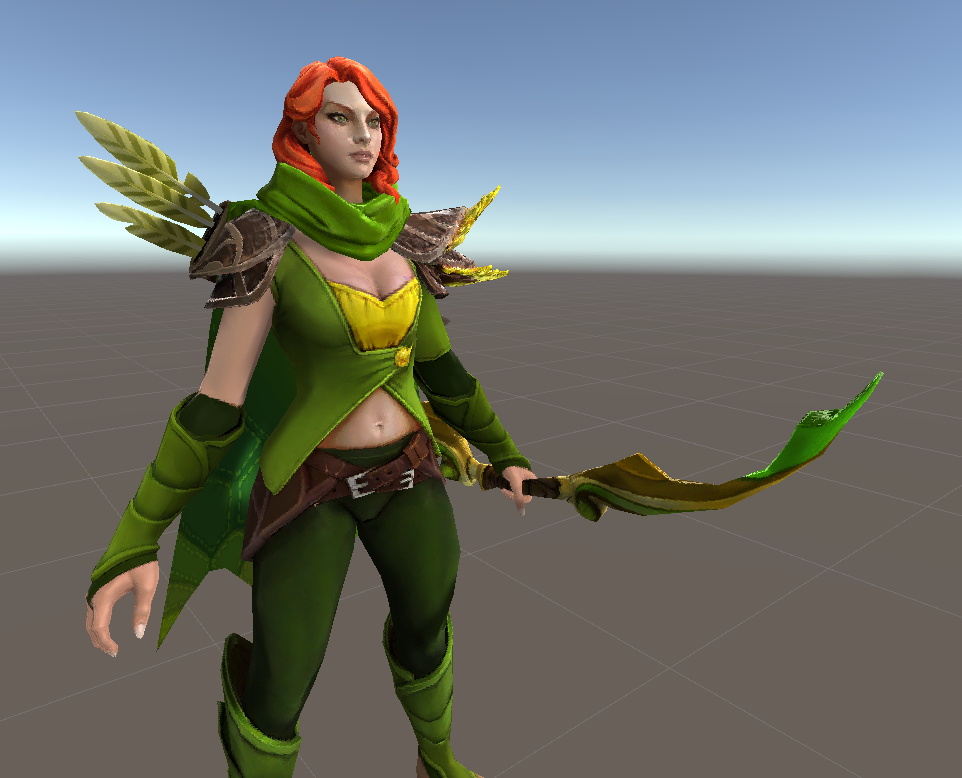

## 08 [透明中的AlphaCut、AlphaBlend与AlphaAdd](./AlphaMode)

透贴的各种模式，当然还有更多的可以自由定义，这里是庄老师讲到的常用的三种。

## 09 [水与火特效](./Water_Fire)

发现游戏里类似的特效很多是靠贴图采样实现的，这就对美术资源的要求更高一些，懒得自己做贴图的话效果好不好全看手上图片资源的质量了。

## 10 [背景扰动](./UVDistort)

对背景图像采样做UV扰动的结果，可以作为空气扰动或假折射效果，扰动值也可以从噪声图中采样。

## 11 [顶点动画](./VertexAnim)

顾名思义，在几何着色器中直接对顶点做出位移，不需要动模型本身就能实现的动画。

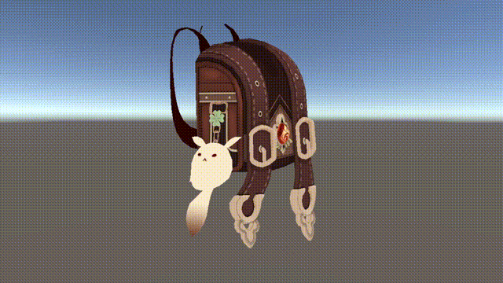

## 12 [科幻出入场](./Cyberpunk)

前几个Demo所涉及知识点的综合运用，大半时间都花在贴图准备上了，还去入门了一下SD，果然做这行得玩转得过来一堆软件……

## 13 [SSAO](./SSAO)

在蒙德接完声望任务转身上楼的时候发现凌华身上泛着一圈白光，那地方完全处在阴影之中首先排除了是Bloom，调整游戏图像设置后发现是后期效果带来的，盲猜用了SSAO，因为其中的远景吸收剔除正好会造成这个特性，不如咱自己也来实现一下。

首先照着游戏搭了个差不多的场景（AO什么的在这种犄角旮旯多的楼道最好体现了），为了观察方便顺手加个第三人称控制器。

为了场景好看一点专门烘焙了全局光照，结果为了在自定义着色器中用上光照贴图踩了不少坑，下面是烘焙好的间接光照混合直接阴影的结果。

接着就是SSAO算法了，实现起来比预想的要难得多，都怪自己太菜，还好网上做知识分享的大佬多，看一下最后的效果吧。

再叠加上GI看看，差不多复现了游戏里角色身上的白光晕。

## 14 [John Lemon's Haunted Jaunt](./JLHJ)

这是Unity官方的3D项目入门教程，玩了这么久Shader发现还没有经历过游戏的全流程开发，总感觉缺了点什么，特此体验，以后也多上上手。

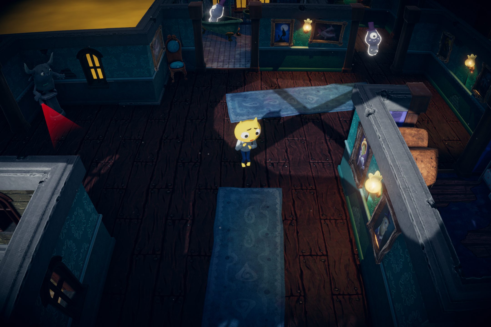

## 15 [游戏引擎的二次开发](https://github.com/Yif1999/Pilot)

吹爆王希学长的GAMES104好吧！全程跟下了这门课和作业，给课程组准备的开源引擎框架加了postprocess、animation blending、toolchain等feature，真的算是人手一个自研引擎了。

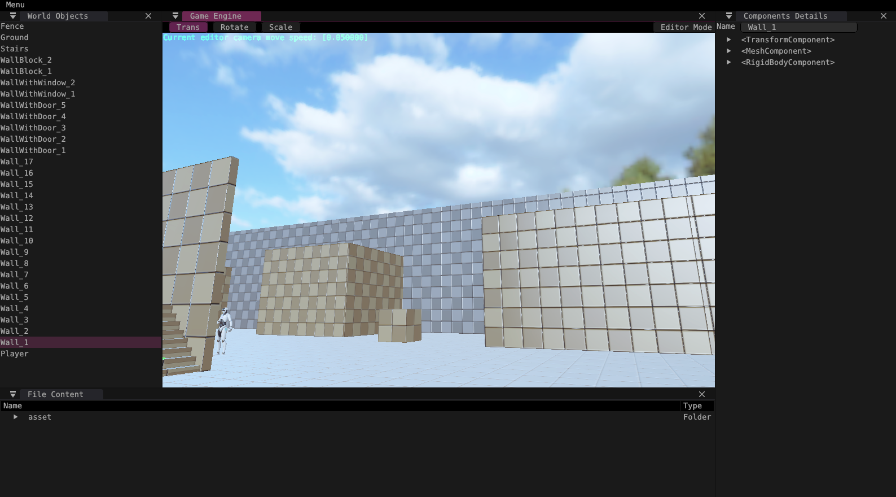

作业达标还有毕业证书和纪念文化衫，简直不要太良心了。

## 16 [Slime Crisis](./SlimeCrisis)

在Unity交流群里看到的一个卖课的广告，首先是开展几天的免费课程完了之后搞推销，太熟悉的套路了。但是怎么说呢，还是可以白嫖一下的，花了几个晚上就做完了所谓的《史莱姆危机》小游戏（后来又打了一次广告宣发里说会带你做另一个游戏，但是一看课程目录全是一样的知识点，好家伙这也能换皮是吧）。

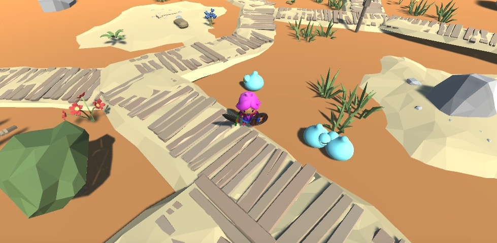

课程中主要是讲C#的编码和Unity的基操，虽然说人家也不怎么解释只是直播敲敲代码然后就运行成功了，但是自己回过头好好看看的话感觉里边用到的面向对象编程的逻辑和抽象思路是值得学习的（仅限OOP新手）。

## 17 [Unity项目性能优化](https://www.bilibili.com/read/cv18188512)

性能优化总是玩家讨论时绕不开的话题，另外优化本身也很有意思，正好Unity课堂中有关于性能优化的课程索性学了起来。

这里是优化最开始的截图，优化后帧率已经大幅提升。实战相关笔记文章发布在了b站专栏，可以点标题访问。

## 18 [Live3D](https://github.com/Yif1999/Live3D)

看到Unity官方提供了Live Capture相关的工具，想着能不能自制一个调用ARKit面部捕捉的虚拟形象应用呢——答案果然是可以的！

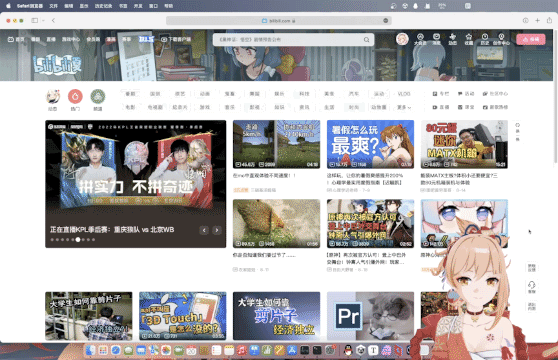

算是面捕重定向小测试，顺便东拼西凑实现了物理模拟等特性，属于是缝合各路大佬教程的技术验证产物。

## 19 [仿原神渲染](./GenshinAvatar)

之前做的Live3D卡渲用的是开源的ShaderGraph着色器，但要跟游戏画面比起来真的还差点意思。既然我的b站推送列表里已经人均会仿渲了，那不如就自己来实现一个吧。

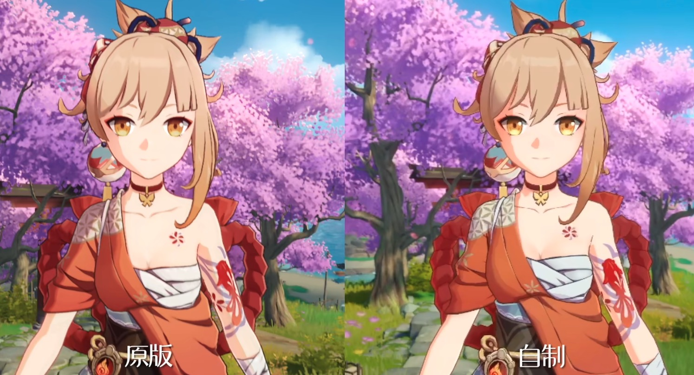

参考了很多前人写的渲染思路分析，不得不说米哈游在细节上是真会抠啊。另外Unity的Live Capture工具里还有提供虚拟摄像机的功能，用在虚拟制片上相当方便，那为什么不拿来用用呢。

于是就有了这个使用ARKit运动捕捉运镜的MMD成片，还额外写了天空盒Shader，实现了地面反射和粒子效果来还原角色界面。

## 20 HoudiniPDG

以前走TA学习路线之前就学过Houdini特效，确实是一个很强大的软件，这下粗浅的接触了一下用HDA来做Houdini和Unity联动的程序化生成管线。

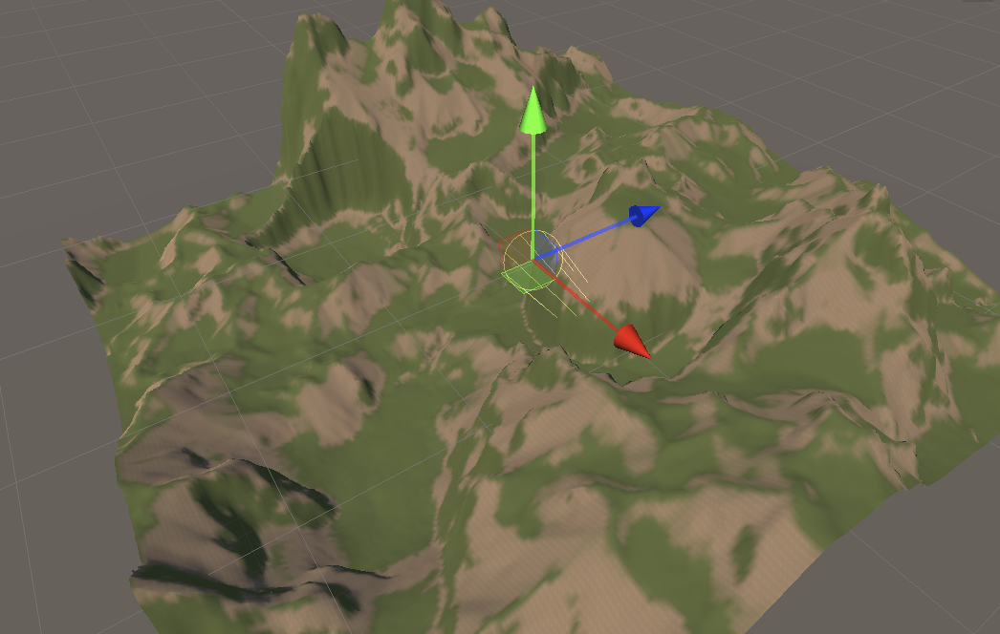

因为案例的视觉效果没有达到我预期的水平，所以也只是浅尝辄止，计划以后大项目里用到再学。

## 21 [软光栅渲染器](https://github.com/Yif1999/MiniEngine/tree/z-buffer)

（又大半年没更新，时间过得真快啊，进步却只有一点点）这个软光栅是结合学校高级图形学课程作业来写的，重点在于层次ZBuffer消隐的算法实现，不过我们肯定要做得好看一点，至少得能显示、能交互对吧。为了实现图形化界面先是自己刷了一遍LearnOpenGL，又去了解了imgui，这些都是很不错的项目。「Talk is cheap. Show me the code」，确实是这样，渲染管线看过千万遍，不如自己下手写一遍去亲自趟过坑才能理解得深刻。

## 22 [光线追踪引擎](https://github.com/Yif1999/MiniEngine/tree/main)

还是结合图形学作业来做的一个项目，重点在蒙特卡洛路径追踪算法，老样子还是想实现得稍微牛逼一些，这次就写一个引擎吧（GAMES104所说的做过作业就是人手一个自研引擎感觉还是不够，这下真的要自己从头去摸一个引擎出来）！

光追部分参考的是RTIOW，引擎框架的参考对象就是104，很大一部分code是从Piccolo直接搬运过来魔改的，可以说是这辈子写过的最庞大的工程了。这个项目花费了我相当多的时间来完成，从最开始的光追实现，到后来的各种加速优化，再到编辑器的实现、跨平台的适配，到处都是软件工程实现上的难题，当然最后也是收获满满（比如用了这么久cmake才第一次搞清楚它的运作逻辑）。

在最后的实现中，我的光追渲染引擎具备了自定义模型导入、多材质支持、纹理映射、相机景深、重要度采样、BVH加速结构、多线程渲染、图像降噪、交互式编辑器等特性，过程中还是砍掉了一些原来计划的feature，比如原本打算参照piccolo给编辑器上场景编辑功能，可以在场景中拖放物体、修改材质属性，于是先前做了很多工作来给引擎加入组件系统、反射系统，结果到了真正开始做编辑器的时候发现piccolo中的场景编辑实现是与vulkan的一些概念强绑定的，这下用OpenGL做后端的我就懵了，考虑到避免重新修改大量代码就放弃了实现，也就导致目前引擎中很大一部分代码被编译却没有被用上，算是个小小的遗憾吧哈哈。不过这下爷真的有属于自己的引擎了！

## 23 [LearnMetal](https://github.com/Yif1999/LearnMetal)

先前不是说piccolo用的vulkan我看不懂吗，比如descriptor之类的，就想在补一下其他图形API相关知识，了解一下它们的架构思路。这里我选的是Metal，至于为什么……别问！问就是任性！

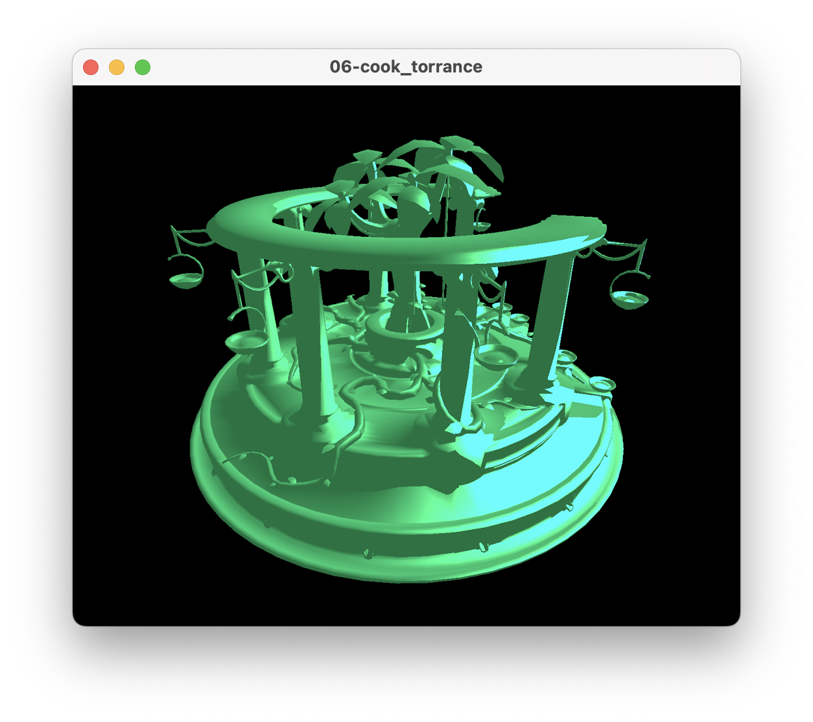

Metal相关资料是真的少啊，靠着仅有的几个博主（发现一个在米的大佬）的文章和油管视频支撑下来的。

## 24 [UnitySRP](https://github.com/Yif1999/CustomSRP)

摸过Metal发现这些现代API使用起来更加有“渲染管线”的逻辑体系，不禁让我想到了Unity里的可编程渲染管线，我还没自己写过管线呢，这怎么行！

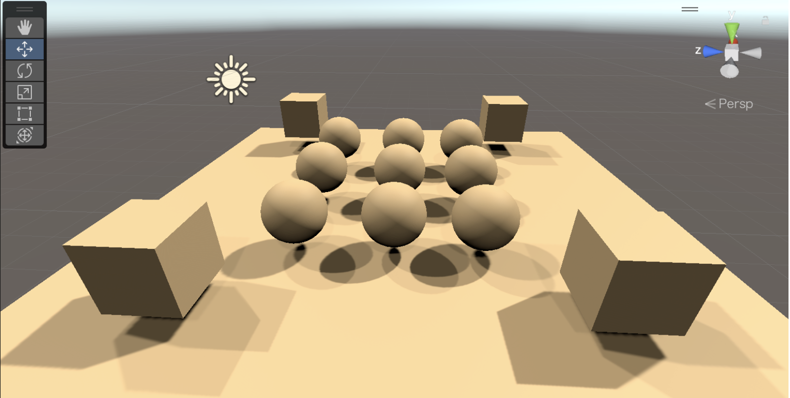

## 25 ComputeShader

玩过了SRP，又想去玩一下ComputeShader，但是没想好用来做什么，所以学完什么也没做，用到再说吧先放一张最基础的计算着色器出的图在这里。

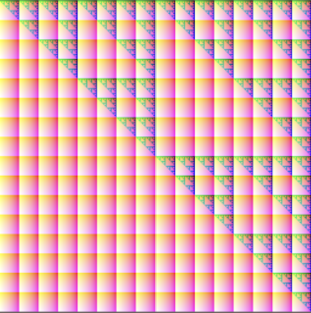
