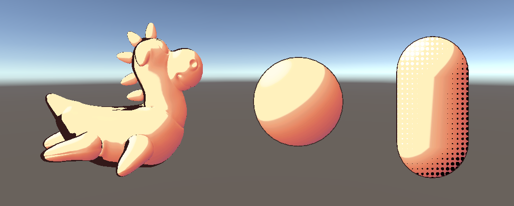
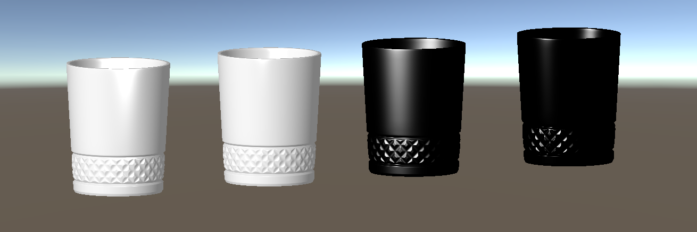
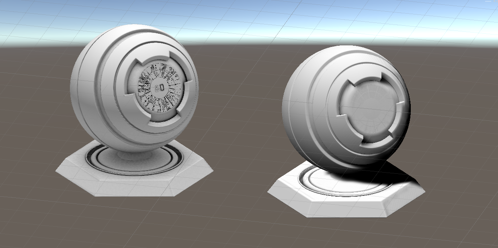

# TA-Learning

正在走技术美术学习路线，在此建仓记录。

## Unity

- [L01](./Unity/L01)——Lembert卡渲

  

- [L02](./Unity/L02)——Phong与Bilinn-Phong

  

- [L03](./Unity/L03)——环境吸收与投影

  
  
- [L04](./Unity/L04)——法线贴图

  

## Houdini

计划中，暂无。

