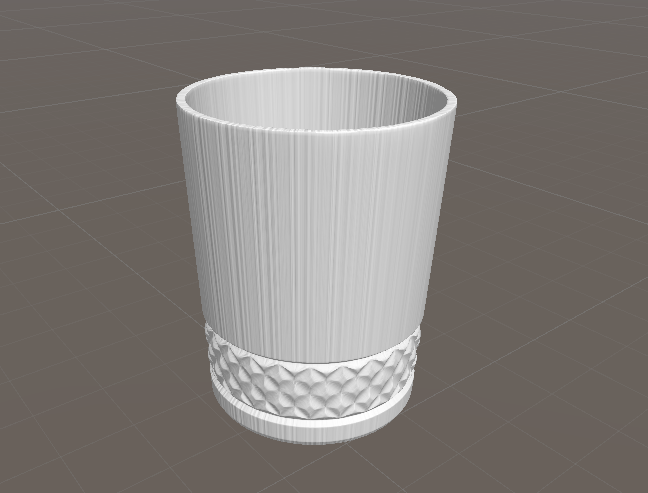

# TA-Learning

正在走技术美术学习路线，在此建仓记录，持续更新。

## Unity

- [L01](./Unity/L01)——Lembert卡渲

  

- [L02](./Unity/L02)——Phong与Bilinn-Phong

  

- [L03](./Unity/L03)——环境吸收与投影

  
  
- [L04](./Unity/L04)——法线贴图

  
  
- [L05](./Unity/L05)——CubeMap与MatCap

  

- [L06](Unity/L06)——经典光照模型实例

  

- [L07](Unity/L07)——AlphaCut、AlphaBlend与AlphaAdd

  

- [L08](Unity/L08)——水与火特效

  

- [L09](Unity/L09)——背景扰动

  

- [L10](Unity/L10)——顶点动画

  

- [L11](Unity/L11)——Cyber出现与消失

  

- [P01](./Unity/P01)——仿原神消隐效果

  

## Houdini

计划中，暂无。

